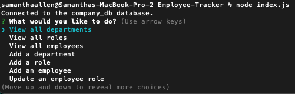
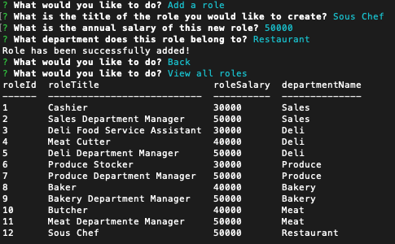
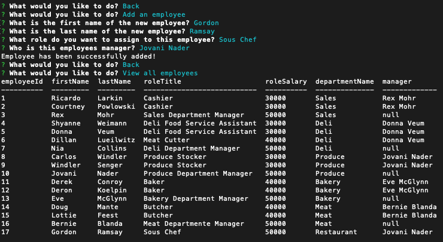
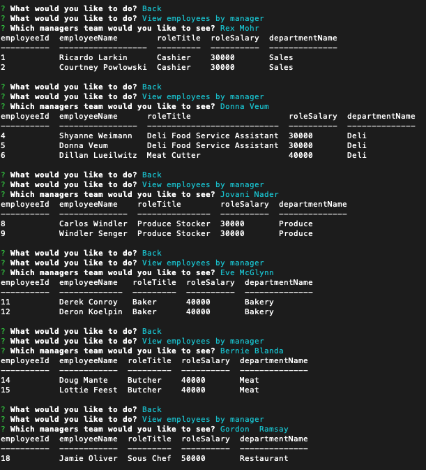
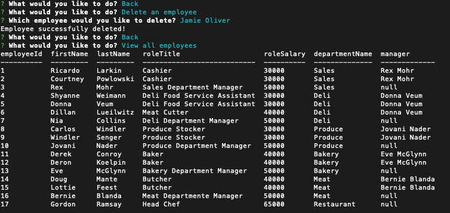
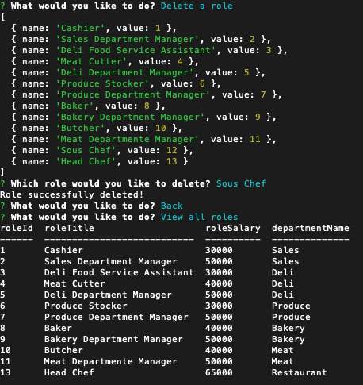
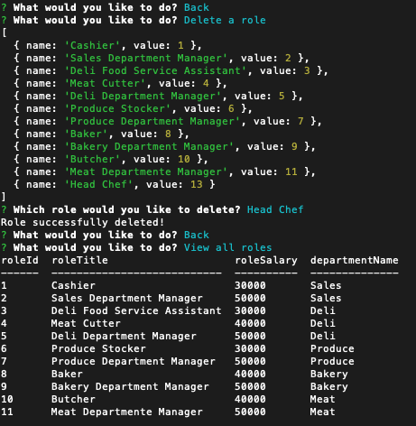
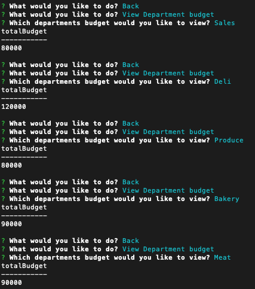
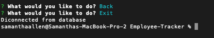

# Employee-Tracker

Walkthrough Video Link 👇🏼
https://drive.google.com/file/d/1_nXz3fz0HSW-hoqIAv-kNhLfSFv0drCm/view?usp=sharing

## Description

This is an employee tracker connected to the mySQL database. My motivation wanting to understand how asynchronous code works and why it would be used. I built this to have an understanding of not only SQL, but how to connect it to node. This allows coordination and organization of data. I learned the importance of understanding how asynchronous code works especially when you are waiting for data to come back from another source. 

## Table of Contents 

- [Installation](#installation)
- [Usage](#usage)
- [Credits](#credits)
- [License](#license)

## Installation

NPM install inquirer@8.2.4 
NPM install mysql2 
NPM install validator 
NPM console.table

## Usage

After you install all required dependencies, first you invoke connection to the database by entering node index.js in the console/terminal/gitbash. A confirmation that connection to database is displayed. Then a list of options appear for the user to choose from by toggling with the arrow keys. To choose you press enter. 
 
 
 
The first three aoptions allow the user to see the tables Employee, Role and Department and the data those tables contain 
 
 
 
The option add department prompts user to input the name of the department. A message is displayed if successful. Then when you view departments you can see the new department added 
 
 
 
The option add role prompts user to input the role title, salary and which department it belongs to. 
 
 
 
 
The option add employee prompts user for first and last name, which role they have and who their manager is if any 
 
 
 
 
The option update employee role prompts user which employee is changing roles, which role they are changing to and a confirmation is displayed once complete. Then if you view employees you can see their role is updated. 
 
 
 
The option view employees by manager will prompt you to choose which managers team you would like to see. 
 
 
 
The option view employees by department will prompt you to choose which departments team you would like to see. 
 
 
 
The option delete employee will prompt you to choose which employee you would like to delete. Then you can view employees to confirm. 
 
 
 
 
The option delete role will prompt you to choose which role you would like to delete. 
 
 
 
 
The option delete department by department will prompt you to choose which department you would like to delete 
 
 
 
The option view departments budget will prompt you to choose which departments budget you would like to see. 
 
 
 
The option to exit will disconnect from the database and exit the application. 
 
 
 

## Credits

I always refer to the class activities for guidance, but thank you to my colleagues Max and Shawn for answering some questions regarding the asynchronous portion. Thank you to Rudie, the askBCS learning assistand for helping me debug a few things. And of course, thank you to my tutor Andrew who helped me untangle the mess I created at one point.

https://www.w3schools.com/sql/sql_update.asp
https://www.w3schools.com/sql/sql_datatypes.asp
https://www.w3schools.com/js/js_errors.asp
https://developer.mozilla.org/en-US/docs/Web/JavaScript/Reference/Statements/switch
https://stackoverflow.com/questions/5266152/how-to-exit-in-node-js
https://developer.mozilla.org/en-US/docs/Web/JavaScript/Reference/Global_Objects/Promise
https://www.w3schools.com/sql/sql_union.asp
https://www.w3schools.com/sql/sql_distinct.asp
https://www.w3schools.com/sql/sql_sum.asp
https://www.w3schools.com/sql/sql_or.asp

## License

The MIT License is short and to the point. It lets people do almost anything they want with your project, like making and distributing closed source versions.

## Badges

N/A

## Features

N/A

## How to Contribute

N/A

## Tests

NPM install all required packages. Write 'node index.js' to connect to database. Explore each option!